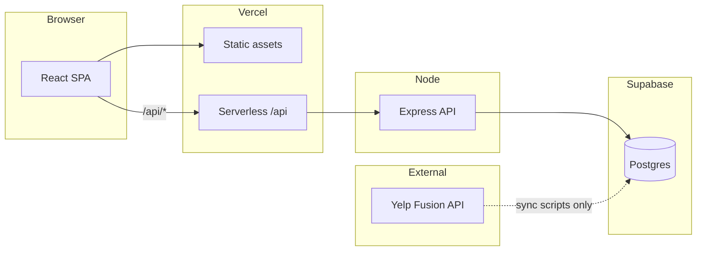

# BitePick

**Stop debating where to eat.** BitePick helps you pick a restaurant in seconds—solo with filters and a random draw, or together in a live group session that turns everyone’s preferences into one place.

**Live app:** [bitepick.vercel.app](https://bitepick.vercel.app)

---

## Features

- **Pick for yourself** — Filter by cuisine, neighborhood, price, and “open now,” then get a random match from the catalog.
- **Run a group session** — Create a shareable room code, collect each person’s preferences, and move through lobby → shortlist → final pick without leaving the browser.
- **Sign in to manage the catalog** — Registered users can add, edit, and remove restaurants; admins get elevated access via an allowlist.
- **Hours-aware suggestions** — Structured weekly hours and “prefer open now” keep recommendations realistic when timing matters.
- **Production deployment** — Single Vercel project serves the React UI and Express API on one origin (`/api/*`).

---

## Architecture



| Layer | Role |
|--------|------|
| **Frontend** (`frontend/`) | React 19 + Vite + Tailwind. Client-side filtering for solo picks; group UI talks to the API. Local dev proxies `/api` to the backend. |
| **Backend** (`backend/`) | Express 5 REST API: auth (JWT), restaurants CRUD, group sessions, weighted ranking. Data access via `@supabase/supabase-js` with the service role key (server only). |
| **Database** | Supabase Postgres: `users`, `restaurants`, `group_sessions`, `group_participants`, and related tables. Incremental SQL lives in `supabase/migrations/`. |
| **Deployment** | Root `vercel.json` builds the SPA and bundles the API as `api/index.ts` → compiled `backend/dist/server.js`. |
| **External APIs** | Yelp Fusion powers optional `npm run sync:restaurants` (maintenance script, not the live request path). |

**Repository layout**

```
bitepick/
├── frontend/          # React app
├── backend/           # Express API, DB module, ranking logic
├── api/               # Vercel serverless entry
├── supabase/migrations/
└── docs/DEPLOYMENT.md # Vercel env vars and production checklist
```

---

## Tech stack

| Area | Choices |
|------|---------|
| Frontend | React, Vite, React Router, Tailwind CSS |
| Backend | Node.js, Express, TypeScript, JWT (`jsonwebtoken` + `bcryptjs`) |
| Database | Supabase (Postgres) |
| Ops / tooling | Prisma (schema + Yelp sync scripts only), Supabase CLI migrations |
| Hosting | Vercel |

---

## Local development

### Prerequisites

- Node.js 20+
- A [Supabase](https://supabase.com) project with the app schema (see **Database** below)
- npm

### 1. Install dependencies

```bash
npm run install:all
# or: npm ci --prefix backend && npm ci --prefix frontend
```

### 2. Configure environment

**Backend** — copy and edit:

```bash
cp backend/.env.example backend/.env
```

| Variable | Required | Purpose |
|----------|----------|---------|
| `JWT_SECRET` | Yes | Signs login tokens; use a long random string |
| `SUPABASE_URL` | Yes | Supabase project URL |
| `SUPABASE_SERVICE_ROLE_KEY` | Yes | Server-side DB access (never expose to the browser) |
| `ADMIN_EMAILS` | Yes | Comma-separated emails allowed admin actions |
| `FRONTEND_URL` | Local dev | `http://localhost:5173` for CORS |
| `PORT` | Optional | API port (default `5000`) |
| `DATABASE_URL` | Scripts only | Postgres URL for Prisma (`sync:restaurants`, dedupe report) |
| `YELP_API_KEY` | Scripts only | Yelp Fusion key for catalog sync |

**Frontend** — copy and edit:

```bash
cp frontend/.env.example frontend/.env
```

| Variable | Required | Purpose |
|----------|----------|---------|
| `VITE_API_BASE_URL` | Local dev | Set to `http://localhost:5173` so Vite proxies `/api` to the backend |
| *(unset)* | Production | Same-origin requests; do not set on Vercel |

### 3. Database

This repo ships **incremental** migrations under `supabase/migrations/`. Apply them in filename order on a Postgres database that already has the base tables (`users`, `restaurants`, `group_sessions`, etc.). The canonical shape is documented in `backend/prisma/schema.prisma` (generated from the live database).

Using the Supabase SQL editor or CLI:

```bash
# Example with Supabase CLI (linked project)
supabase db push
# or run each file in supabase/migrations/ manually in order
```

### 4. Run the app

Two terminals:

```bash
npm run dev:backend   # http://localhost:5000 — API
npm run dev:frontend  # http://localhost:5173 — UI, /api proxied
```

Verify the API: `curl http://localhost:5000/api/health` → `{"ok":true}`.

### Optional: seed restaurants from Yelp

Requires `DATABASE_URL` and `YELP_API_KEY` in `backend/.env`:

```bash
npm run sync:restaurants --prefix backend
```

---

## Engineering decisions

**Custom JWT auth instead of Supabase Auth** — Keeps login/register on the API with hashed passwords in Postgres and a simple `Authorization: Bearer` flow. Tradeoff: no built-in OAuth or refresh-token UX; acceptable for a focused product surface.

**Supabase client + service role on the server** — Runtime handlers use `@supabase/supabase-js` rather than Prisma to keep the deployed API bundle small and queries explicit. Prisma is reserved for offline scripts (Yelp sync, dedupe reports) where `DATABASE_URL` is appropriate.

**Same-origin API in production** — The frontend resolves API URLs from `window.location.origin`, so production never hard-codes a separate API host. Local dev uses Vite’s proxy via `VITE_API_BASE_URL=http://localhost:5173`.

**Weighted group ranking** — Group picks score restaurants by overlapping filters across participants, with host filters constraining the pool and optional “open now” filtering. Shortlist generation uses a weighted draw among top candidates to avoid always picking the same highest score.

**Guest hosts** — Sessions can be created without an account; a `hostClaimSecret` stored client-side authorizes host-only actions, so casual groups do not require sign-up.

**Rate limiting** — Auth and restaurant-creation routes are limited to reduce brute-force and abuse on a serverless surface.

**Incremental SQL in-repo** — Schema evolution is tracked as ordered migration files for Supabase, while `schema.prisma` documents the full model for tooling.

---

## Deployment

Production runs on Vercel (frontend + API). Environment variables, domain setup, and troubleshooting are documented in [docs/DEPLOYMENT.md](docs/DEPLOYMENT.md).

---

## Author

Built by **Peter Lin** — [GitHub](https://github.com/pterdactyl)

---

## License

Private / portfolio project. All rights reserved unless otherwise noted.
